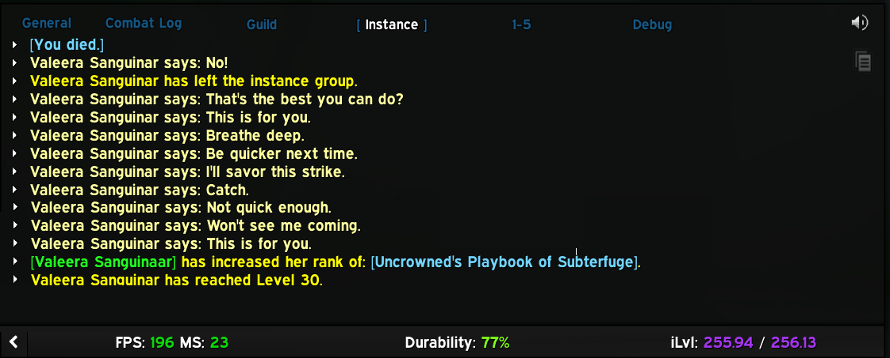
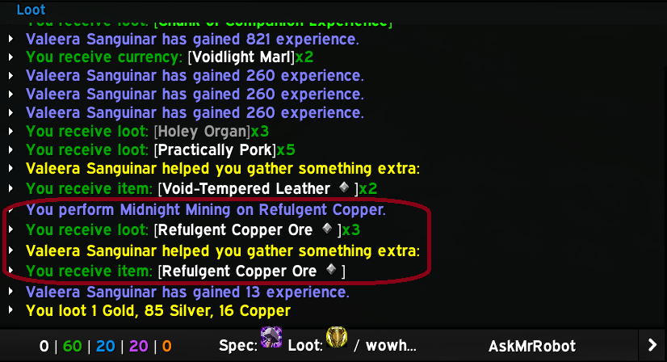

# QuietValeera

Fed up with hearing and seeing the same emotes from Valeera?

An efficient, lightweight, high-performance World of Warcraft addon that silences Valeera.

## Why use this?

<strong><span style="color:#ba372a">TL;DR</strong></span> <span style="color:#2dc26b">reduced audio and chat distraction while Delving in Midnight.</span>

## Key features

- **Sound muting:** Mutes all of Valeera's voice lines and emote sound effects on login
- **Chat filtering:** Removes all of Valeera's say, yell, and emote messages from chat channels
- **Debug mode:** Optional debug channel to view Valeera's messages when needed
- **Ultra-fast:** Single-pass string comparison filter with minimal overhead
- **Efficient:** ~2KB RAM usage, runs once on login for sound mutes
- **Respects settings:** Works seamlessly with your WoW chat channel preferences

## Installation

1. Move/copy the `QuietValeera` folder to your `_retail_/Interface/AddOns/` directory
2. Restart World of Warcraft or logout and login

On load/login, the addon mutes a set of Valeera voice/sound effect IDs so the emotes are silent for the session.

## Configuration

The addon requires no setup. All silencing happens automatically on login.

### Debug mode

To view Valeera's messages while debugging or testing:

```
/quietvaleera debug on
```

This creates or reuses a chat window called `Debug` and routes all of Valeera's messages there. Other chat windows remain unaffected.

To disable debug mode:

```
/quietvaleera debug off
```

## Is this addon really necessary?

In a recent Twilight Crypts Delve, I had 109 lines of Valeer's chat that I didn't see (as recorded instead in the debug log while testing). That's a lot of lines of text scrolling your other chat mesages away into oblivion. Sure, you can use a separate window for her and other creature messages but the authour's feeling is that her chat doesn't add to the game experience.

I use a couple of different chat windows to separate out message sources: General, Guild, Instance, 1-5 (1. General, 2. Trade, 3. LocalDefense, 4. Services, 5. WorldDefense), Debug, and Loot.

### Note

Valeera does emote "system" type messages in chat, I decided to leave these enabled as in a complete Delve she only said a few lines eg.



If there's interest, I could disable the "Valeers Sanguinar says: xyz" messages via a slash command.

Also, if I'd disabled these "system" messages from her that'd make my "Loot" window look odd: in the below example I'd not have been able to see what Valeera contributed to my ore mining:



## Technical details

### Sound muting

- **Event-based mute:** uses a frame listening for `PLAYER_LOGIN` and runs once per login
- **MuteSoundFile loop:** iterates through 160+ Valeera sound IDs and mutes each via `MuteSoundFile(id)`
- **One-time execution:** `muted` flag prevents repeated re-muting if the event fires more than once
- **Memory efficient:** sound ID table is set to `nil` after muting to release memory

### Chat message filtering

- **Ultra-fast filter:** Single string comparison per message
- **Respects chat settings:** Only called by WoW for enabled chat channel types
- **Supported events:**
  - `CHAT_MSG_MONSTER_SAY` (creature say messages)
  - `CHAT_MSG_MONSTER_YELL` (creature yell messages)
  - `CHAT_MSG_MONSTER_EMOTE` (creature emotes like casting)
  - `CHAT_MSG_TEXT_EMOTE` (text-based emotes)
  - `CHAT_MSG_SAY` (player say)
  - `CHAT_MSG_EMOTE` (player emote)

### Debug mode

- **Duplicate prevention:** Tracks last message to avoid duplicate entries
- **Smart frame handling:**
  - Searches case-insensitively for existing `debug` chat window
  - Creates one if it doesn't exist (once per session)
  - Configures it to receive only creature say/emote messages
- **Proper formatting:**
  - Say/yell: `[QuietValeera Debug] Valeera Sanguinar: <message>`
  - Emotes: `[QuietValeera Debug] Valeera Sanguinar <emote text>`

### Performance

- **Tiny footprint:** ~2KB RAM during gameplay
- **Minimal CPU:** filters run only on Valeera messages, single string comparison
- **One-time cost:** 160+ mutes executed once on login, then discarded

## Credit

Inspired by NAESSAH's addon [ShutUpValeera](https://www.curseforge.com/wow/addons/shutupvaleera).

## Contributing

Contributions to improve this tool are welcome! To contribute:

1. Fork the repository
2. Create a feature branch
3. Make your changes to the source code or documentation
4. Test with various class configurations and buff scenarios
5. Submit a pull request with a clear description of the improvements

Please ensure your changes maintain compatibility with existing functionality and follows Lua best practices.

## Bugs and new features

Found a bug or want to submit a feature request?
[open an issue here](https://github.com/ExponentiallyDigital/QuietCraft/issues)

## Support

This tool is unsupported and may cause objects in mirrors to be closer than they appear etc. Batteries not included.

## License

This program is free software: you can redistribute it and/or modify it under the terms of the GNU General Public License as published by the Free Software Foundation, either version 3 of the License, or (at your option) any later version.

This program is distributed in the hope that it will be useful, but WITHOUT ANY WARRANTY; without even the implied warranty of MERCHANTABILITY or FITNESS FOR A PARTICULAR PURPOSE. See the GNU General Public License for more details.

You should have received a copy of the GNU General Public License along with this program. If not, see <https://www.gnu.org/licenses/>.

Copyright (C) 2026 ArcNineOhNine
